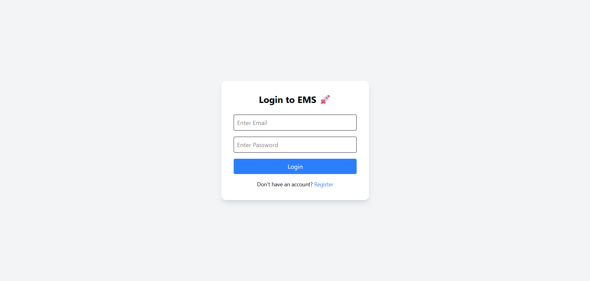
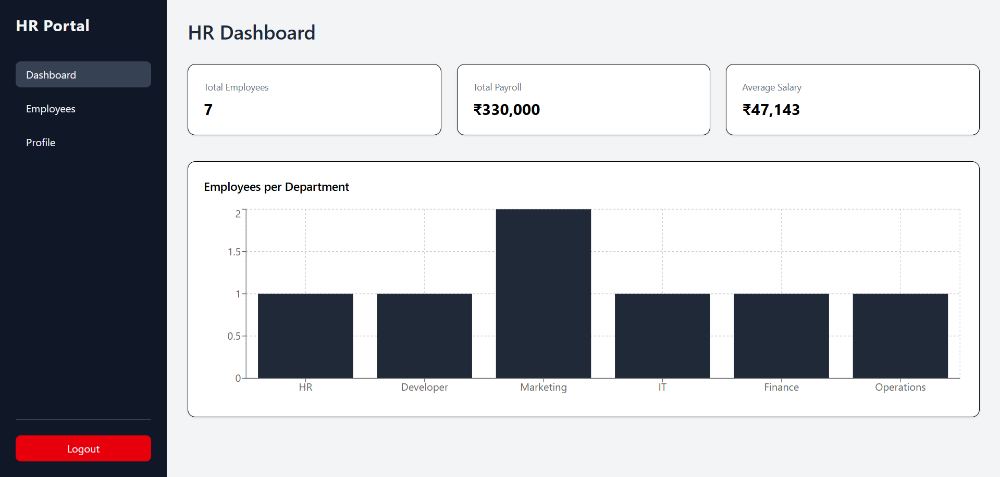
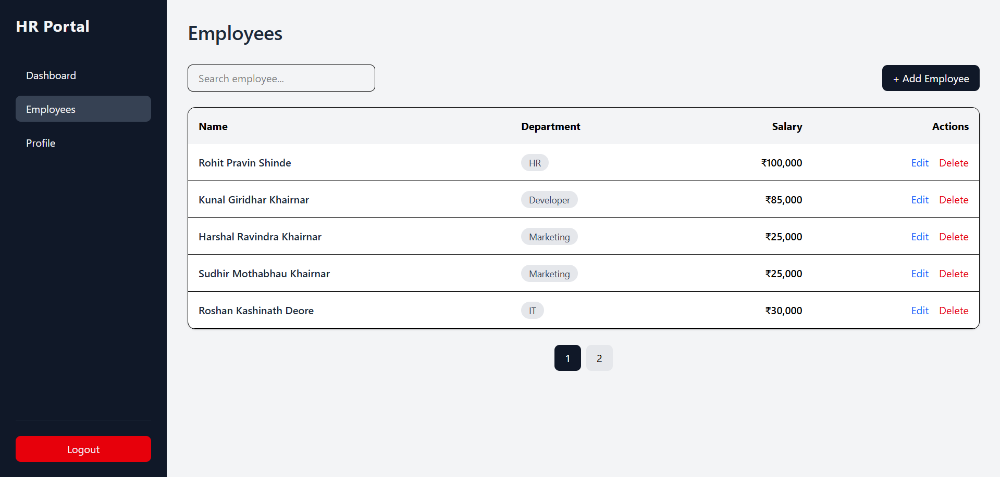
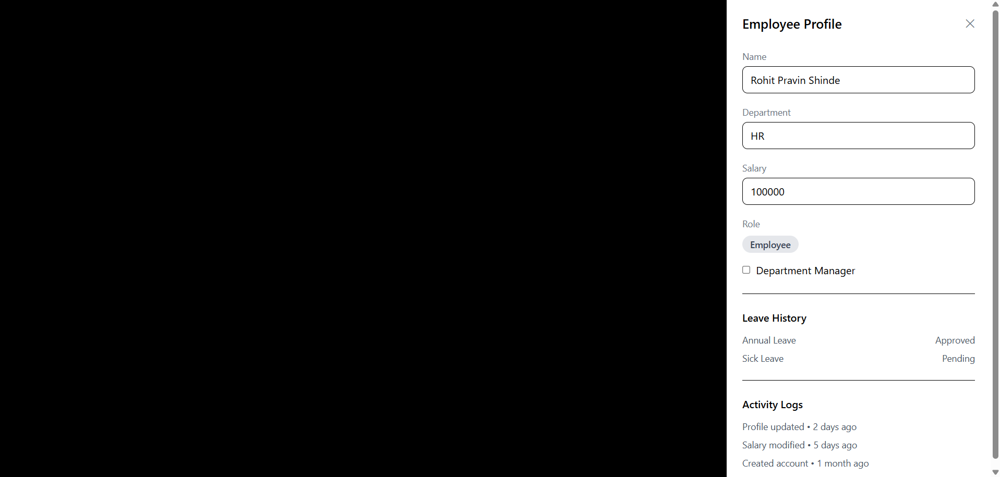
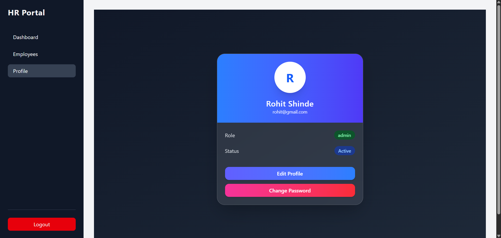

# Visit Live
https://employee-management-system-frontend-fek2j6dbn.vercel.app/

---

# 🏢 Employee Management System (Full Stack)

A Full Stack Employee Management System built using **React.js, Node.js (Express), and MongoDB**.

This system allows Admins to manage employees and Employees to securely log in, view, and update their profiles.

---

## 🚀 Tech Stack

### 🔹 Frontend
- React.js
- Tailwind CSS
- Axios
- React Router
- React Toastify
- Recharts (for analytics)

### 🔹 Backend
- Node.js
- Express.js
- MongoDB (Mongoose)
- JWT Authentication
- bcryptjs

### 🔹 Tools
- VS Code
- Postman
- MongoDB Atlas
- Git & GitHub

---

## 🔐 Features

### 👨‍💼 Admin Capabilities
- Add Employee
- Edit Employee
- Delete Employee
- View All Employees
- Role Management (Admin / Employee / Manager)
- Department Assignment (Dropdown – no spelling mistakes)
- View Leave History
- View Activity Logs
- Secure JWT Authentication

### 👤 Employee Capabilities
- Register & Login
- View Profile
- Edit Limited Profile Details
- Change Password
- View Leave History

### 🌟 UI & UX Features
- Corporate Sidebar Layout
- Employee Drawer Panel (Slide-in profile view)
- Department Dropdown
- Search Employees
- Pagination
- Loading States
- Toast Notifications
- Role Badges
- Responsive Design

---

## 🗂 Project Structure
employee-management-system/
│
├── employee-frontend/
│ ├── src/
│ │ ├── components/
│ │ ├── pages/
│ │ ├── services/
│ │ └── App.jsx
│ └── package.json
│
├── employee-backend/
│ ├── controllers/
│ ├── models/
│ ├── routes/
│ ├── middleware/
│ └── server.js

---

## ⚙️ Installation Guide

### 1️⃣ Clone Repository
git clone https://github.com/your-username/employee-management-system.git

cd employee-management-system

---

### 2️⃣ Backend Setup
cd employee-backend
npm install

Create a `.env` file:
MONGO_URI=your_mongodb_connection_string
JWT_SECRET=your_secret_key

Run backend:
npm run dev

---

### 3️⃣ Frontend Setup
cd employee-frontend
npm install
npm run dev

---

## 🔐 Authentication Flow

1. User registers
2. Password is hashed using bcrypt
3. JWT token is generated
4. Token stored in localStorage
5. Protected routes verify token
6. Role-based access control implemented

---

## 🧾 Database Models

### User Model
- name
- email
- password (hashed)
- role (admin / employee / manager)
- departmentManager (boolean)

### Employee Model
- name
- department
- salary
- role
- timestamps

### Leave Model
- employeeId
- leave type
- status (Pending / Approved / Rejected)
- startDate
- endDate

### Activity Log Model
- userId
- action
- timestamp

---

## 📊 Dashboard Features

- Total Employees
- Total Payroll
- Average Salary
- Employees per Department (Bar Chart)
- Corporate Analytics View

---

## 📸 Screenshots

> Create a folder named `screenshots/` in the root directory and add images:

- login.png
- dashboard.png
- employees.png
- drawer.png
- profile.png

Then they will automatically render here.

Example:

---

